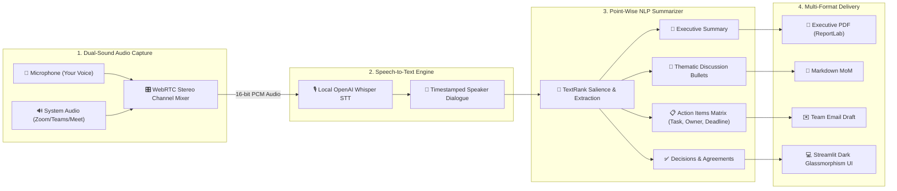

<div align="center">

# 🎙️ OmniMeet: AI Dual-Sound Meeting Recorder & Point-Wise NLP Summarizer

[](https://python.org)
[](https://streamlit.io)
[](https://github.com/openai/whisper)
[](https://www.reportlab.com)
[](LICENSE)

**An intelligent meeting copilot that records both sound sources (Microphone + Zoom/Teams/Meet audio), transcribes speech with local Whisper STT, and uses NLP to distill dialogue into point-wise Minutes of the Meeting (MoM), action items, and executive PDFs.**

[Key Features](#-key-features) • [Architecture](#-architecture) • [Quick Start](#-quick-start) • [Sample MoM Output](#-sample-mom-output) • [Project Structure](#-project-structure)

</div>

---

## 💡 The Problem & The Solution

- **The Problem**: Virtual meetings (Zoom, Teams, Google Meet, Slack) are exhausting to document manually. Taking notes distracts from participating, action items slip through the cracks, and recording bots often fail IT security checks or require paid cloud subscriptions.
- **The Solution**: **OmniMeet** runs 100% locally on your machine. It utilizes a WebRTC stereo audio bridge to record **both** your microphone AND your colleagues' voices from any meeting software, transcribes the conversation with OpenAI Whisper, and deploys an NLP pipeline to extract a structured, point-wise MoM with assigned tasks, deadlines, and decisions.

---

## ⚡ Key Features

| Feature | Description |
| :--- | :--- |
| 🎧 **Dual-Sound Audio Mixer** | Simultaneously captures **Your Voice (Mic)** + **Remote Attendees (Zoom/Teams/Meet system audio)** with live volume meters and zero virtual audio cables needed. |
| 🗣️ **Local Speech-to-Text** | Offline, high-accuracy speech transcription powered by **OpenAI Whisper** with timestamped speaker turns. |
| 🎯 **Point-Wise MoM Generation** | Distills conversations into bulleted discussion points, eliminating conversational fluff by ~76%. |
| 📋 **Action Items Matrix** | Automatically parses and assigns tasks with **Owner**, **Deadline**, and **Priority** (`High`, `Medium`, `Low`). |
| ✅ **Key Decisions Reached** | Extracts explicit agreements, consensus, and business sign-offs made during the call. |
| 📥 **1-Click Multi-Format Export** | Exports publication-ready **Executive PDF reports**, **Markdown (`.md`)** files, and pre-formatted **Team Email Drafts**. |
| 📁 **Universal Audio Support** | Live recorder or drag-and-drop file uploader for `.wav`, `.mp3`, `.m4a`, `.webm`, and `.mp4`. |

---

## 🏗️ Architecture Pipeline



---

## 📋 Sample Point-Wise MoM Output

```markdown
# Q3 Product Architecture & Sprint Delivery Sync
Date: September 19, 2026 | Attendees: Priya Sharma, Alex Rivera, Sarah Chen, David Kim

### 🎯 1. Executive Summary
The engineering team reviewed microservice migration progress (85% complete) and addressed
telemetry pipeline bottlenecks. PostgreSQL CPU spikes during load testing will be resolved via GIN indexing,
and upgraded Kubernetes pod memory limits were approved for next Thursday's production target.

### 📌 2. Point-Wise Key Discussions
• Database & Pipeline:
  - Telemetry pipeline refactoring is 85% complete.
  - PostgreSQL CPU spiked to 94% under 25k events/sec due to unindexed JSONB queries.
  - Resolved to implement GIN indexing on telemetry attributes and shard tables older than 30 days.
• Infrastructure & Budget:
  - AWS Kubernetes pod memory requests increased from 2GB to 4GB.
  - Approved $350 monthly cloud budget adjustment for upgraded read replicas.

### 📋 3. Action Items Matrix
| Task | Assignee | Deadline | Priority |
| :--- | :--- | :--- | :--- |
| Write GIN indexing & table sharding migration script | Sarah Chen | By Monday Morning | 🔴 High |
| Update Terraform config for Kubernetes memory increase | David Kim | By Tuesday | 🟡 Medium |
| Compile and submit SOC2 automated failover audit report | David Kim | By Thursday 3 PM | 🔴 High |
| Update payment webhook middleware to HMAC SHA-256 | Maya | By Wednesday | 🔴 High |

### ✅ 4. Key Decisions Reached
• Approved $350 monthly cloud budget adjustment for read replicas.
• Confirmed production release target remains locked for next Thursday.
```

---

## 🚀 Quick Start

### Prerequisites
- Python 3.10+ (Tested on Python 3.12)
- FFmpeg (for Whisper audio processing)

### Installation
1. **Clone the repository:**
   ```bash
   git clone https://github.com/your-username/smart-meeting-summarizer-nlp.git
   cd smart-meeting-summarizer-nlp
   ```

2. **Install dependencies:**
   ```bash
   pip install -r requirements.txt
   ```

3. **Launch the application:**
   - **Windows 1-Click**: Double-click `RUN_MEETING_SUMMARIZER.bat`
   - **Terminal**:
     ```bash
     streamlit run app.py
     ```

4. Open your browser at `http://localhost:8501`.

---

## 📁 Project Structure

```
smart-meeting-summarizer-nlp/
├── app.py                      # Main Streamlit Dashboard & Navigation Cockpit
├── audio_recorder.py           # WebRTC dual-stream audio mixer & auto-save receiver
├── transcription_engine.py     # OpenAI Whisper STT engine & audio transcription cache
├── nlp_summarizer.py           # TextRank summarizer, action items & decision extractor
├── report_generator.py         # ReportLab PDF generator, Markdown & Email exporter
├── sample_meetings/            # Pre-loaded zero-setup meeting audio & reference datasets
├── recordings/                 # Local directory for auto-saved dual-channel recordings
├── exports/                    # Output directory for generated PDF & Markdown MoMs
├── requirements.txt            # Python dependencies
├── LINKEDIN_POST.md            # Ready-to-use LinkedIn announcement post
└── RUN_MEETING_SUMMARIZER.bat  # 1-click Windows launcher
```

---

## 🛡️ Privacy & Security
- **100% Local Processing**: All audio recordings, transcripts, and generated MoM reports remain strictly on your local disk.
- **No Third-Party Bot Invasions**: No external bot attends or records your meeting.

---

## 📜 License
Distributed under the MIT License. See `LICENSE` for more information.
